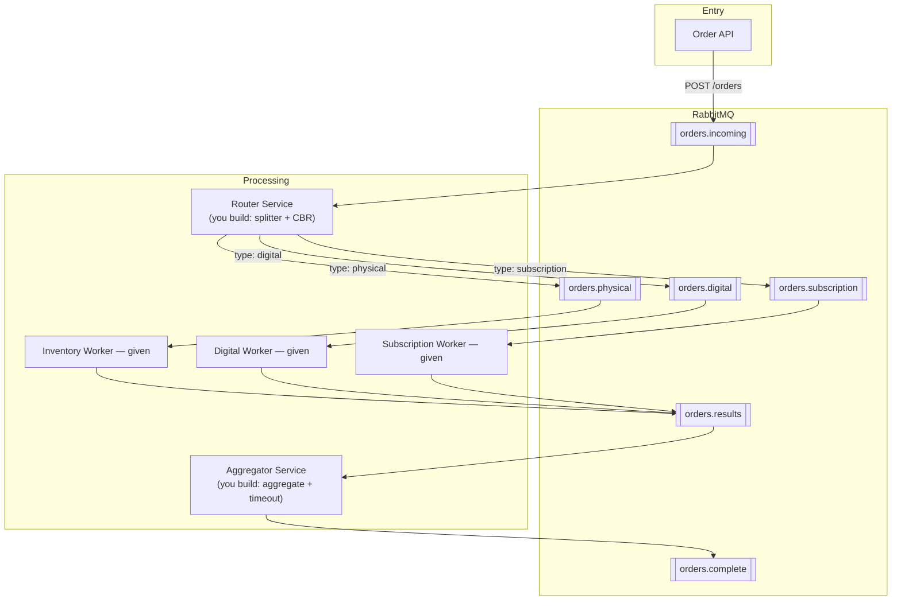

# PA3 — Splitter, content-based router, aggregator

| | |
|---|---|
| **Session** | S3 — Routing patterns · 2026-09-23, C111 |
| **Scaffold language** | Python |
| **Published** | with S3 on 2026-09-23 |
| **Deadline** | **2026-10-05, 20:00 Europe/Riga** |
| **Hard cut-off** | **2026-10-12, 20:00** — miss it and the capstone is not graded |
| **Weight** | one seventh of the homework half — about 7.1% of the final grade |
| **Mark** | 70% automated tests, 30% manual (ADR quality, self-assessment honesty) |
| **ADR** | `docs/adr-002.md` |

---

## The situation

An order comes in with a handful of line items. Some are physical and need
shipping. Some are digital and need a download link. Some, this time, are
subscriptions and need an activation. One order, three destinations, and
somebody downstream needs to know when *all* of it is done — including the
uncomfortable case where one of those destinations never answers.

This is three of the Enterprise Integration Patterns wired together, and
they are the three you will use again and again once you leave this
course: **Splitter**, **Content-Based Router**, **Aggregator**. The scaffold
gives you a working entry point and two working workers. You build the
middle.

Unlike PA1, this scaffold stays in Python (Flask + `pika`), on purpose:
reading and correctly extending somebody else's service in an unfamiliar
language is itself an integration skill, and this is the only point in the
course that asks it of you.

---

## Architecture



| Component | Role | Status |
|---|---|---|
| `starter/order-api` | Receives orders, publishes to `orders.incoming` | given, working |
| `starter/router-service` | Splits the order, routes each item by type | **you build this** |
| `starter/inventory-worker` | Processes `physical` items | given, working |
| `starter/digital-worker` | Processes `digital` items | given, working |
| `starter/subscription-worker` | Processes `subscription` items | given, working |
| `starter/aggregator-service` | Collects results, completes or times out | **you build this** |

The workers are given so that a `physical`, `digital`, or `subscription`
item has somewhere to actually go and something to actually produce. Your
work is entirely in `router-service` and `aggregator-service`.

---

## What you build

### 1. The splitter (in `router-service`)

Turn one order with N items into N independent messages. Every one of
those messages must carry the same `orderId`/`correlationId` and the same
`totalItems` — that is what lets the aggregator, downstream, put the order
back together even though its items are now travelling on three different
queues, possibly out of order, possibly at different speeds.

### 2. The content-based router (in `router-service`)

Route each split-off item message to a queue chosen by `item.type`:

| `item.type` | Queue |
|---|---|
| `physical` | `orders.physical` |
| `digital` | `orders.digital` |
| `subscription` | `orders.subscription` |

The scaffold you are given currently only knows about two of these three.
Extending it to a third type is the point — a router that only ever
reproduces what it already had is not a router, it is a fixed pipe.

### 3. The aggregator (in `aggregator-service`)

Collect results from `orders.results`, grouped by `orderId`. When every
item of an order has reported in, publish one completion message to
`orders.complete`.

But workers do go down, or never start. If an order sits incomplete for
too long, the aggregator must give up waiting and publish a **partial**
result instead — flagging exactly which items it never heard from — rather
than holding that order open forever. A hung order is a worse failure than
an honest partial answer.

Two more things the aggregator must get right that are easy to get wrong:
a **duplicate** result (the same item redelivered — this happens for real
whenever a worker acks a message late) must not be counted twice, and two
orders in flight **at the same time** must never have their results mixed
into each other.

---

## The message contracts

These are not suggestions — the tests check the exact shape.

**Item message** (router-service → `orders.physical` / `orders.digital` /
`orders.subscription`):

```jsonc
{
  "orderId": "…",
  "correlationId": "…",       // same value as orderId
  "itemIndex": 0,              // this item's position in the original order
  "totalItems": 3,             // length of the original order's items array
  "item": { "type": "physical", "name": "Laptop", "price": 999.99 }
}
```

**Completion message** (aggregator-service → `orders.complete`), exactly
one per order:

```jsonc
{
  "orderId": "…",
  "correlationId": "…",
  "status": "complete",                 // or "partial"
  "totalItems": 3,
  "receivedItems": 3,                   // 3, or however many arrived before timeout
  "itemResults": [ /* the result messages you collected */ ],
  "missingItemIndexes": []              // itemIndex values never received; [] when complete
}
```

`missingItemIndexes` is always present, on both statuses — empty for a
complete order, non-empty for a partial one.

---

## Running it

```bash
cd pa3
docker compose up -d --build --wait
npm --prefix tests ci          # once, before your first test run
npm --prefix tests test
```

No `make`, and no Windows-specific step — Docker Compose and `npm` are all
this assignment needs beyond what Session 0 already proved works on your
machine.

**Rebuild after every edit.** Each service's code is copied into its image
when the image is built, so a change to `router-service/app.py` or
`aggregator-service/app.py` does nothing until you run
`docker compose up -d --build --wait` again. If a change seems to have no
effect, this is almost always why.

The order API is on host port **8083**, not 8080 — Session 0's echo
container holds 8080, and comes back every time Docker starts unless you
stopped it.

Watch what actually happens:

```bash
docker compose logs -f router-service aggregator-service
```

Open <http://localhost:15672> (`guest` / `guest`) to see queue depths
directly — this is the fastest way to tell "my router isn't publishing
anything" apart from "my router is publishing to the wrong queue".

Tear down (including the `pa3-routing` state) with:

```bash
docker compose down -v
```

### Submitting an order by hand

```bash
curl -X POST http://localhost:8083/orders \
  -H "Content-Type: application/json" \
  -d '{
    "customerId": "cust-123",
    "items": [
      {"type": "physical", "name": "Laptop", "price": 999.99},
      {"type": "digital", "name": "Software License", "price": 49.99},
      {"type": "subscription", "name": "Support Plan", "price": 14.99}
    ]
  }'
```

See [`starter/order-api/openapi.yaml`](starter/order-api/openapi.yaml) for
the full API documentation.

---

## Where to start

The gutted scaffolds fail loudly, not silently: with nothing implemented,
`docker compose up` still comes up healthy (the connection handling and
consume loops are given and working), but no message ever reaches
`orders.physical`, `orders.digital`, `orders.subscription`, or
`orders.complete` — every public test times out waiting for something
that never arrives. That is expected. Work in this order:

1. **Get one item routed.** Implement the splitter loop and the `physical`
   branch of the content-based router in `router-service/app.py`. Confirm
   with the RabbitMQ management UI that a message actually lands in
   `orders.physical`.
2. **Route all three types**, including `subscription` — the type the
   given lab never had to handle.
3. **Get the happy-path aggregation working**: collect results, complete
   when the count matches `totalItems`.
4. **Add the timeout.** It must be an **idle** timeout — measured from the
   last result received for that order, not from when the order arrived —
   so a large order whose workers are all still answering never times out
   mid-flight. Read the value from `AGGREGATOR_IDLE_TIMEOUT_SECONDS` (the
   scaffold already does); `docker-compose.yml` sets it to 5 seconds and
   the public tests assume that. Make sure a stopped worker produces a
   partial result instead of a hang.
5. **Handle duplicates and concurrent orders** — the hidden tests probe
   both, and both fall out for free from a data structure keyed
   correctly by `orderId` and `itemIndex`.

If you are stuck for more than thirty minutes, ask — see
[CONTRIBUTING.md](../CONTRIBUTING.md).

---

## What is tested

Public tests (`tests/public/`, run them yourself with `npm --prefix tests
test`) are black-box: they talk to `order-api` over HTTP, and to RabbitMQ
over AMQP and its management HTTP API. They never import your Python code.
They check that:

- a 3-item order produces exactly 3 item messages, split across the
  correct queues, every one carrying the originating `orderId`
- a mixed order routes `physical` items and `digital` items correctly
- a 4-item order that includes a `subscription` item routes it to the
  subscription worker and completes with all 4 results
- the aggregator emits exactly one completion message with all N results
  when every worker answers
- two orders submitted back to back do not have their results mixed up
- an order where one worker is stopped outright still produces a
  completion message — within the timeout, flagged `"status": "partial"`,
  naming the missing item — instead of hanging forever
- `docs/adr-002.md` exists with its four required sections

**Hidden tests** also run at grading time. They are never published, they
test the same requirements stated above, not new ones, and they exist so
that code written to satisfy the visible fixtures specifically does not
score well — among other things, they check a 50-item order, two
interleaved orders under real concurrency, and a duplicate item result.
If your implementation is correct rather than tuned to the visible cases,
you will not notice they exist.

---

## Your ADR

`docs/adr-002.md`, four sections, one page. **It is 30% of this
assignment's mark.** The template has the prompts; the short version of
what it is asking:

> You made at least four real decisions building this: how correlation
> survives the splitter, what timeout value you would run in production
> and why, what "partial" actually contains, and how a duplicate result
> gets ignored instead of double-counted. Show your reasoning on the ones
> that were genuinely open questions for you.

Write it after the code, while the annoyance is still fresh.

---

## Submitting

Your work goes in **your** repository, not this one:

```text
eai-2026-<surname>/
  pa3/
    starter/       your implementation of router-service and aggregator-service
                    (order-api, inventory-worker, digital-worker,
                     subscription-worker unchanged, as given)
    tests/public/  unchanged, as given
    docs/adr-002.md
    docker-compose.yml
```

Then submit your repository URL through the portal at
**<https://evaluentis.leitass.eu>**. Never by email.

The graded commit is the SHA at `HEAD` **when you submit** — later pushes
are not seen. Run `docker compose up -d --build --wait && npm --prefix tests test`
one more time before you do.

See [how an assignment works](../README.md#how-an-assignment-works) in the
root README for the late penalty and the progression gate.

---

## Common ways to lose marks

| | |
|---|---|
| Router only handles `physical`/`digital` | `subscription` is a required third branch, not a stretch goal here |
| Aggregator counts messages, not items | A redelivered duplicate inflates the count and the order never completes right, or completes with a phantom extra result |
| Fixed deadline instead of idle timeout | A legitimately large order (the hidden 50-item case) times out mid-flight even though every worker is healthy and still working |
| `"status": "partial"` with no indication of what's missing | Technically "not hanging", but useless to whatever consumes `orders.complete` — the whole point of a partial result is knowing what to retry |
| Global mutable state with no lock | Two orders in flight at once corrupt each other's counts under real concurrency, intermittently, in a way that is miserable to debug later |
| An ADR that restates this README | 30% of the mark, and I have read this README |
