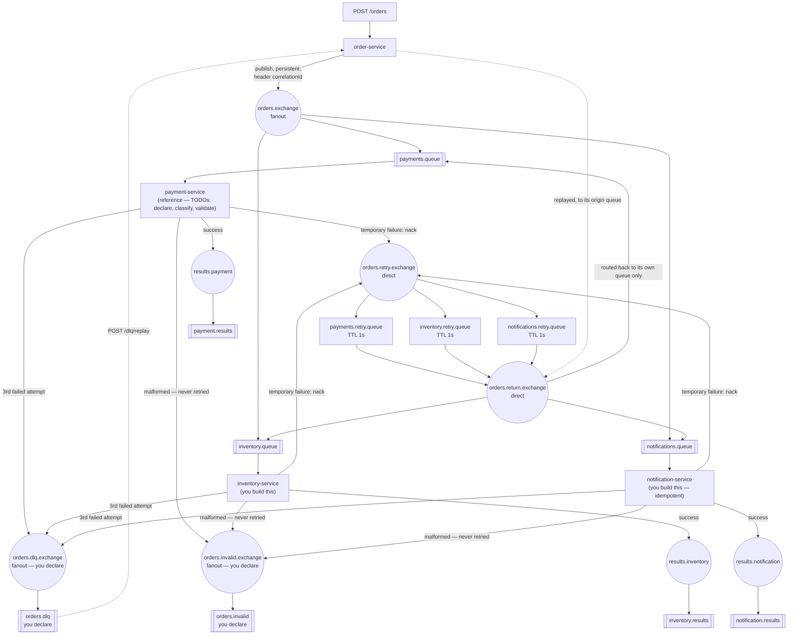

# PA5 — Events, dead-letter queues, idempotency

| | |
|---|---|
| **Session** | S5 — Reliable messaging and error handling · 2026-10-14, A410 |
| **Scaffold language** | TypeScript |
| **Published** | with S5 on 2026-10-14 |
| **Deadline** | **2026-10-26, 20:00 Europe/Riga** |
| **Hard cut-off** | **2026-11-02, 20:00** — miss it and the capstone is not graded |
| **Weight** | one seventh of the homework half — about 7.1% of the final grade |
| **Mark** | 70% automated tests, 30% manual (ADR quality, self-assessment honesty) |
| **ADR** | `docs/adr-004.md` |

---

## The situation

An order placed on your system has to reach three independent departments —
payment, inventory, notification — and none of them should have to know the
other two exist. None of them are reliably up, either: a payment provider
that is down for thirty seconds is not your order service's outage, and it
is definitely not a reason to lose the order.

You build the producer and let three consumers subscribe independently
(publish-subscribe over a fanout exchange). You build a retry path that
gives a failing consumer a few seconds to recover before giving up and
routing the message somewhere a human can look at it (dead-letter channel,
TTL-based delayed retry) — and a way for that human to send it back once
the cause is fixed (replay). Not every failure deserves a retry: a message
nobody can even parse will fail identically forever, so your consumers
classify it as permanent and move it straight out of the way (invalid
message channel). Every message carries a correlation id so the whole
lifecycle of one order can be traced across three unrelated services' logs
(correlation identifier).

And because delivery is at-least-once, the same order can reach a consumer
twice — an ack lost after the work was done, a producer that publishes
twice, a replay of something that half-succeeded. At least one of your
consumers has to cope with seeing the same order twice without doing its
work twice (idempotent receiver).

This is PA2 all over again, with three consumers instead of one and a
failure path that actually gets exercised. The retry path is provided and
pre-declared. The two channels at the end of it — dead letter and invalid —
are yours to declare.

---

## What you are given

`shared/rabbit.ts` — `connectWithRetry(url)` (exponential-backoff connect,
handles the container startup race against RabbitMQ), `getRetryCount(msg)`
(how many times this message has already failed, read from the `x-death`
header RabbitMQ attaches once a message has been dead-lettered), and
`withoutRetryHistory(headers)` (for replay — see order-service below).
Mounted read-only into every service container at `/shared`; import it by
relative path (`../../shared/rabbit`).

`shared/canonical-order.ts` — a TypeScript mirror of
[`../canonical/order.schema.json`](../canonical/order.schema.json) (owned by
the course since PA4). PA5 does not transform anything — every message this
assignment moves is already in this shape.

`rabbitmq/definitions.json` — the **retry topology**, loaded by RabbitMQ on
startup: `orders.exchange`, the three consumer queues, the retry and return
exchanges, the three retry queues, and the results exchanges and queues.
The dead letter channel and the invalid message channel are **not** in it —
see "Declare what you publish to" below.

`order-service/`, `inventory-service/`, `notification-service/` —
**empty** `src/server.ts` scaffolds. You write all of it.

`payment-service/` — **the reference consumer**. `src/server.ts` already has
the RabbitMQ connection, the `channel.consume` registration, and the full
retry/DLQ logic working. Study this file before touching the other two — it
is the pattern you replicate in `inventory-service` and
`notification-service`. Three TODOs in it are yours: declare the two
channels, classify a failure as permanent or temporary, and the payment
simulation itself.

`examples/order.json` — a canonical order for posting by hand.

Every scaffold's process stays alive on its own even completely untouched
(see the comment at the top of each `src/server.ts`) — `docker compose up
-d --build --wait` is expected to succeed regardless of how much you have
implemented. This assignment is graded to fail at `npm --prefix tests test`,
with a readable message, not at `docker compose up --wait`, with a timeout.

---

## Architecture



**Read this carefully:** `payments.retry.queue`, `inventory.retry.queue` and
`notifications.retry.queue` each dead-letter back through
`orders.return.exchange` (a **direct** exchange) to their **own** consumer
queue only — not back through the fanout. This is a deliberate topology
choice over the naive version (retry queues dead-lettering straight back to
`orders.exchange`), which would re-deliver every retried message to **all
three** consumers, not just the one that failed. Replay uses the same
return exchange for the same reason. See `docs/adr-004.md` for why the
naive version is still worth knowing about, and why the idempotency
requirement exists regardless of which topology you use.

---

## What to build

### Declare what you publish to

Every consumer publishes to two channels that `definitions.json` does not
create. Declare both in **every** consumer, before it starts consuming —
`assertExchange`, `assertQueue` and `bindQueue` are idempotent, so three
services declaring the same channel is normal, and each one then works no
matter which starts first. order-service declares the dead letter channel
too, because replay reads from it.

| Channel | Exchange | Queue | Binding |
|---|---|---|---|
| Dead letter | `orders.dlq.exchange` — `fanout`, `durable: true` | `orders.dlq` — `durable: true`, no arguments | routing key `""` |
| Invalid message | `orders.invalid.exchange` — `fanout`, `durable: true` | `orders.invalid` — `durable: true`, no arguments | routing key `""` |

Declare them with **exactly** these properties everywhere. A second
declaration of the same name with different properties is refused with
`PRECONDITION_FAILED`, and RabbitMQ closes the channel that made it.

### Permanent or temporary

Classify every failure before you retry it:

- **Temporary** — it might succeed next time. In PA5 that is the simulated
  failure (`*_FAIL_RATE`). It goes through the retry path; after its
  **third** failed attempt, publish it to `orders.dlq.exchange`.
- **Permanent** — it will fail identically on every attempt. At minimum: a
  body that is **not valid JSON**. Publish it to `orders.invalid.exchange`
  with its **original bytes and headers**, ack it, and do not retry it —
  retrying it only delays the diagnosis by three attempts and puts it in
  the DLQ, where it does not belong. You decide what else counts as
  permanent (a missing `correlationId` header, say); name it in your ADR.

Parse the body **inside** your `try` block. A `JSON.parse` outside it
throws out of the consume callback and takes the whole consumer down —
and because the message was never acked, RabbitMQ delivers it again on
restart, and it crashes again.

Every publish in this assignment is `persistent: true`. The queues are
durable, but a durable queue keeps a non-persistent message only until the
broker restarts.

### 1. `order-service/src/server.ts` — empty

- **`POST /orders`** — body is a canonical order (see
  `shared/canonical-order.ts`). It already has an `orderId`; you did not
  invent it and you do not renumber it. Generate a correlation id
  (`crypto.randomUUID()` — built into Node 20, no dependency needed) and
  publish the order **unchanged** to `orders.exchange`, with
  `headers: { correlationId }` and `persistent: true`. Do **not** add a
  `correlationId` field to the order object itself — the canonical schema's
  `additionalProperties` is `false`, so an extra field on the body is a
  validation error, not a convenience. See `docs/adr-004.md` for why
  correlationId lives in a header instead. Store the order in memory keyed
  by correlationId, and respond `201` with
  `{ correlationId, status: "accepted" }`.
- **`GET /orders/:correlationId`** — `200` with `{ correlationId, order }`
  if found, `404` otherwise.
- **`POST /dlq/replay`** — send every message in `orders.dlq` back to the
  consumer that failed it, and respond `200` with
  `{ replayed: <how many> }`. Take messages one at a time with
  `channel.get("orders.dlq")`. The `originQueue` header (set by the DLQ
  publish in payment-service's catch block — keep it when you copy that
  block) names the queue it came from: republish the original bytes to
  `orders.return.exchange` with that queue name as the routing key, so only
  that consumer sees it again. Use `withoutRetryHistory(headers)` from
  `shared/rabbit.ts` for the headers — it keeps `correlationId` and drops
  `x-death`, so the replayed message gets a fresh three attempts instead of
  going straight back to the DLQ. Ack each DLQ message only after
  republishing it. There is no replay for `orders.invalid`: a message
  nobody can parse needs its producer fixed, not a second delivery.
- **`GET /health`** — `200` with `{ status: "ok" }`.

### 2. `payment-service/src/server.ts` — partially scaffolded

Three TODOs, all marked in the file:

- Declare the two channels (above).
- In the `try` block, replace the `throw new Error("Not implemented...")`
  with: roll a random number against `PAYMENT_FAIL_RATE`; below it, throw;
  otherwise, `ack` and publish a result event to `results.payment` with the
  same `correlationId` header.
- At the top of the `catch` block, classify: a permanent failure goes to
  `orders.invalid.exchange` and returns; a temporary one falls through to
  the provided retry/DLQ logic — do not modify that part.

### 3. `inventory-service/src/server.ts` — empty

Same pattern as `payment-service`, mechanically identical: declare the two
channels, consume `inventory.queue`, use `INVENTORY_FAIL_RATE`, publish to
`results.inventory`. Copy the classify-then-retry/DLQ catch block from
`payment-service` rather than reinventing it — it is intentionally shared
code that happens to be duplicated per service, not a library, because
seeing it three times is part of the point this week.

### 4. `notification-service/src/server.ts` — empty

Declare the two channels and consume `notifications.queue`. Before
processing, check whether `correlationId` is already in
`/data/processed-ids.json` (bind-mounted, survives a service restart) — if
so, `ack` silently and log "duplicate skipped", **without** touching
`/data/notification.log`. Otherwise append one JSON line to
`/data/notification.log`:

```jsonc
{"correlationId":"...","orderId":"...","customerEmail":"...","timestamp":"...","message":"Order received"}
```

add the correlationId to the processed set, persist it, `ack`, and publish
a result event to `results.notification`. Same classify-then-retry/DLQ
catch block as the other two.

**Why the correlation id is the idempotency key here**, when Session 5 says
the message id usually is: notification-service handles exactly one
message per order, so the correlation id identifies the unit of work — it
is a business key (S5 deck, appendix A2). It also catches what a message id
would miss: the same order published again as a *new* message, with a new
message id. The public tests do exactly that.

---

## Ports — this assignment's own range

RabbitMQ AMQP is on host port **5674**, the management UI on **15674**, and
order-service's HTTP API on **3002**. Every container is named `pa5-*`.
Payment/inventory/notification have no host port mapping — nothing outside
the Docker network needs to reach them directly. This is the same
non-overlapping-ranges convention as every other PA in this repo; if a
`docker compose up` here ever fails to bind a port, the fix is never "stop
another assignment's stack."

RabbitMQ itself runs as a named user (`eai` / `eai-pa5`), not `guest`/
`guest` — see `docs/adr-004.md` and PA2's `docs/adr-001.md` for why.

---

## Running it

```bash
cd pa5
docker compose up -d --build --wait
npm --prefix tests ci          # once, before your first test run
npm --prefix tests test
```

Windows: `docker compose` and `npm`, nothing else.

**Rebuild after every edit.** Each service's code is copied into its image
when the image is built, so a change to a `src/server.ts` does nothing until
you run `docker compose up -d --build --wait` again. If a change seems to
have no effect, this is almost always why.

The full suite takes a little over two minutes: it restarts services and
waits out real retry delays rather than mocking them.

Watch the retry path actually happen:

```bash
docker compose logs -f payment-service
```

Force payment to fail and watch the DLQ fill — Bash:

```bash
PAYMENT_FAIL_RATE=100 docker compose up -d payment-service
curl -X POST http://localhost:3002/orders -H "Content-Type: application/json" -d @examples/order.json
```

PowerShell (`curl.exe`, not `curl`, which PowerShell maps to something
else):

```powershell
$env:PAYMENT_FAIL_RATE = "100"; docker compose up -d payment-service; Remove-Item Env:PAYMENT_FAIL_RATE
curl.exe -X POST http://localhost:3002/orders -H "Content-Type: application/json" -d "@examples/order.json"
```

Open <http://localhost:15674> (`eai` / `eai-pa5`) and watch `orders.dlq`
gain a message about two seconds later (three attempts, one second apart).
Then put the fail rate back and replay it:

```bash
docker compose up -d payment-service           # no override: back to the default
curl -X POST http://localhost:3002/dlq/replay  # PowerShell: curl.exe -X POST ...
```

The tests set the fail rates they need themselves, and reset them to the
defaults when they finish.

To watch a malformed message, use the management UI: **Exchanges →
`orders.exchange` → Publish message**, add a header `correlationId` with
any value, set the payload to `{ not json`, and publish. `orders.invalid`
should gain three messages — one from each consumer — and nothing should
retry.

Tear down (including the RabbitMQ data volume) with:

```bash
docker compose down -v
```

---

## Where to start

1. **`order-service` first** — `POST /orders` and `GET /orders/:correlationId`.
   Nothing else is reachable without it — every test posts an order before
   it asserts anything. Replay can wait until step 6.
2. **Read `payment-service/src/server.ts` end to end** before writing
   anything else. The retry/DLQ block you are about to duplicate is already
   there, working, and commented.
3. **Declare the two channels** in payment-service, then fill in its
   simulation and its classification.
4. **`inventory-service`**, copying that pattern.
5. **`notification-service`**, the idempotency check first — get the happy
   path (one order, one log line) working, then the duplicate case.
6. **`POST /dlq/replay`** in order-service.
7. **Watch a full DLQ cycle and a replay once**, by hand, before trusting
   the automated tests to tell you it worked.

If you are stuck for more than thirty minutes, ask — see
[CONTRIBUTING.md](../CONTRIBUTING.md).

---

## Rules

`amqplib` (and, for `order-service` only, `express`) are the only runtime
dependencies this assignment needs — already in each service's
`package.json`. You do not need a validation library to check the incoming
body's shape against the canonical schema; a handful of `typeof` checks is
enough for this week (PA4 already did schema-shaped validation properly;
this assignment is about messaging, not re-litigating that).

You may of course read documentation, and you may use AI tools — but see
[SYLLABUS.md](../SYLLABUS.md) §12: you have to be able to defend every line
in November, on your own code, with a fault planted in it.

---

## What is tested

Public tests (`tests/public/`, run them yourself with `npm --prefix tests
test`) are black-box: HTTP against order-service, AMQP and the management
API against the broker, and the notification files on disk. Tests 1–7 are
the proven JS lab's checks this assignment is ported from, unchanged in
behaviour; 8–10 were added this year. They check that:

1. order-service is reachable and all three consumer queues have an active
   consumer
2. `POST /orders` returns `201` with a UUID v4 `correlationId`, and the order
   can be fetched back by it
3. `orders.exchange` is a fanout exchange with all three consumer queues
   consuming
4. forcing `PAYMENT_FAIL_RATE=100` and posting an order lands a message in
   `orders.dlq`
5. one order's `correlationId` shows up on all three `*.results` queues
6. sending the same order twice to `notifications.queue` produces exactly
   one `notification.log` line, not two
7. a message that reaches the DLQ carries an `x-death` header showing it
   went through the retry path first
8. the dead letter and invalid message channels exist, as specified above
9. a malformed message sent through `orders.exchange` reaches
   `orders.invalid` from all three consumers — original bytes, never
   retried, and not in `orders.dlq`
10. `POST /dlq/replay` sends a dead-lettered payment back to payment-service
    only: it succeeds, the DLQ is drained, and inventory does not process
    the order a second time
11. `docs/adr-004.md` exists with its four sections

There are no hidden PA5 test cases — every test is public. That does not
mean tuning your code to these literal assertions is a good idea: they are
black-box checks of the requirements stated above, and a correct
implementation passes them without having been aimed at them.

---

## Your ADR

`docs/adr-004.md`, four sections, one page. **It is 30% of this
assignment's mark.** The template has the prompts; the short version of what
it is asking:

> You made at least five real decisions this week: where correlationId
> actually lives on the wire, why three attempts, why the idempotency check
> is a file and not an in-memory `Set`, what you classify as permanent, and
> what makes replay safe. Show your reasoning on the ones that were
> genuinely open questions for you.

Write it after the code, while the annoyance is still fresh.

---

## Submitting

Your work goes in **your** repository, not this one:

```text
eai-2026-<surname>/
  pa5/
    shared/                    your copy, unchanged unless you found a real bug in it
    order-service/             your implementation
    payment-service/           your implementation (scaffold's retry/DLQ block kept)
    inventory-service/         your implementation
    notification-service/      your implementation
    tests/public/              unchanged, as given
    examples/order.json
    docker-compose.yml
    rabbitmq/
    docs/adr-004.md
```

Then submit your repository URL through the portal at
**<https://evaluentis.leitass.eu>**. Never by email.

See [how an assignment works](../README.md#how-an-assignment-works) in the
root README for the late penalty and the progression gate. The graded
commit is the SHA at `HEAD` **when you submit** — later pushes are not
seen. Run `docker compose up -d --build --wait && npm --prefix tests test`
one more time before you do.

---

## Common ways to lose marks

| | |
|---|---|
| `channel.publish(routingKey, exchange, ...)` | Backwards. It is `channel.publish(exchange, routingKey, content, options)` — exchange first |
| `nack(msg, false, true)` (requeue=true) | Skips the retry delay entirely and can loop forever with no `x-death` header ever appearing |
| Acking the original message AND publishing to the DLQ separately without acking | The message ends up both processed and stuck in the consumer queue |
| `Number(process.env.PAYMENT_FAIL_RATE) \|\| 20` | `Number("0")` is `0`, and `0 \|\| 20` is `20` — a configured fail rate of zero silently becomes the default. Use `?? "20"` |
| `JSON.parse` outside the `try` block | One malformed message crashes the consumer, and RabbitMQ redelivers it on every restart |
| Retrying a malformed message | It fails identically three times, lands in the DLQ where it does not belong, and fails again when replayed |
| Declaring a channel with different properties in different services | The second declaration is refused with `PRECONDITION_FAILED` and its channel is closed |
| Publishing to `orders.dlq.exchange` without declaring it | The first message that reaches the DLQ closes the channel with `NOT_FOUND` |
| Replaying through `orders.exchange` | The fanout delivers the message to all three consumers, not only the one that failed |
| Replaying with the old `x-death` header | `getRetryCount` still sees three failures, so the replayed message goes straight back to the DLQ on its first failure |
| Publishing without `persistent: true` | A durable queue keeps a non-persistent message only until the broker restarts |
| In-memory idempotency `Set` for notification-service | Passes the visible test (no restart happens mid-test) but loses all dedup state on `docker compose restart notification-service` — say so in your ADR if you do this anyway |
| Adding `correlationId` as a field on the canonical order body | `additionalProperties: false` in `canonical/order.schema.json` makes this a schema violation, not a convenience |
| Forgetting `channel.prefetch(1)` | Messages dispatched faster than they are processed; ack ordering breaks under load, intermittently |
| Leaving RabbitMQ on `guest`/`guest` | Works over AMQP, then can quietly fail management-API calls made from outside the container on some hosts — see `docs/adr-004.md` |
| An ADR that restates this README | 30% of the mark, and I have read this README |
